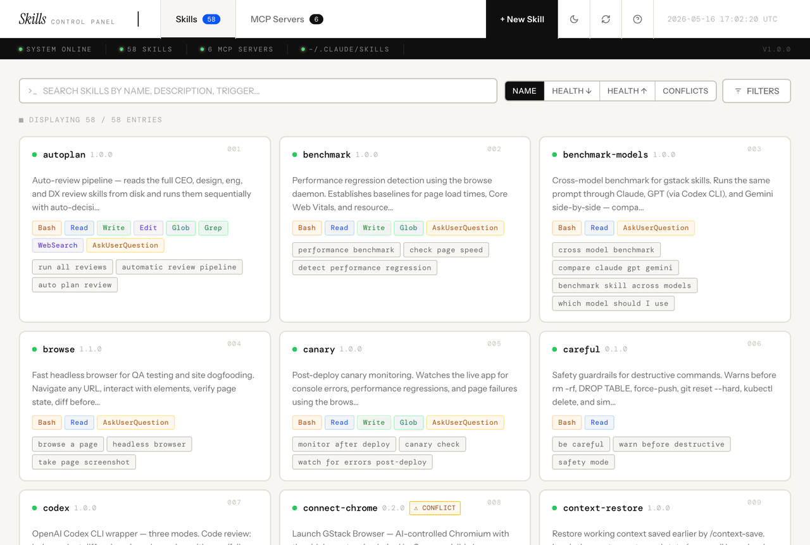
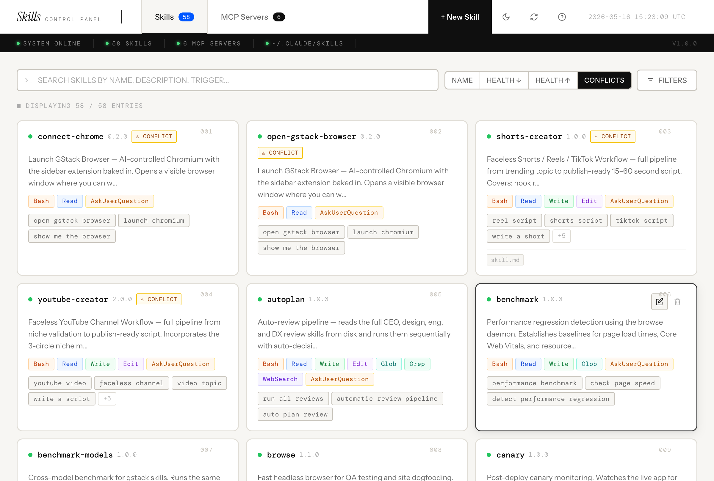
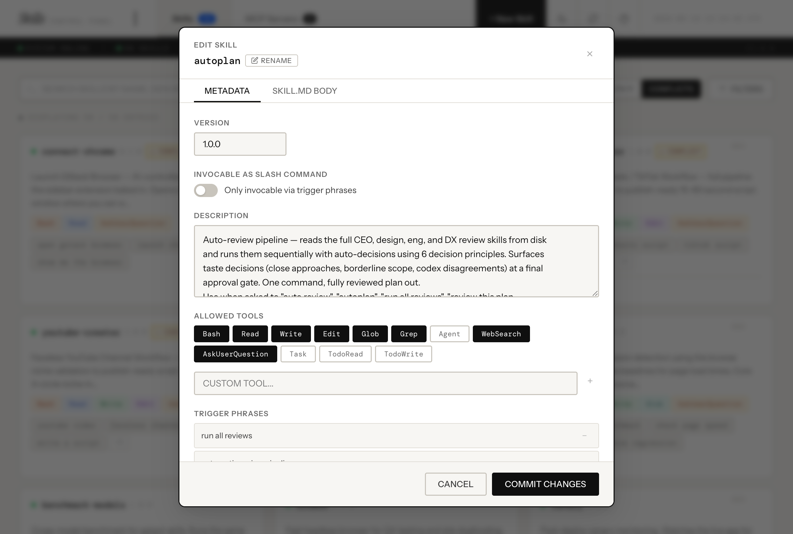
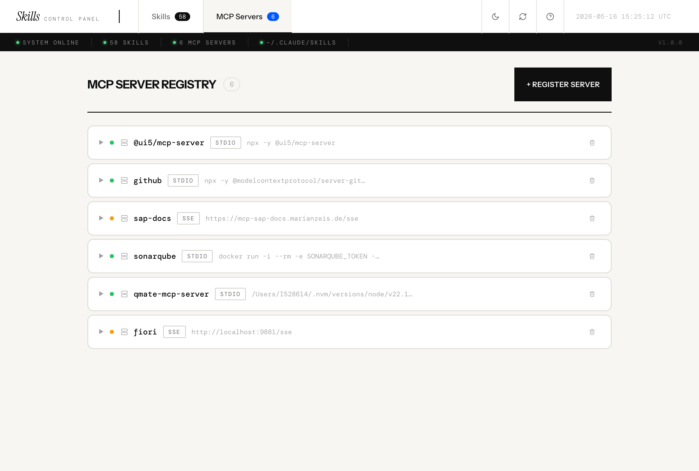
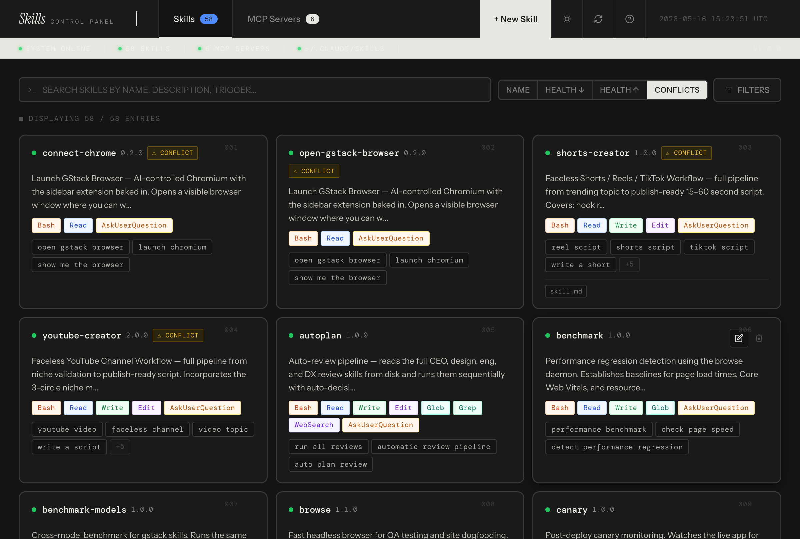

# Skills Control Panel

> **The missing UI for Claude Code.** Browse, edit, create, and rename all your skills and MCP servers from a single dashboard — without ever touching a YAML file.
>
> **First of its kind.** Skill marketplaces let you find skills. This lets you manage the ones you already have — locally, no account, no sync, no cloud.



---

## The problem it solves

You've built 20+ Claude Code skills. They live in `~/.claude/skills/` as markdown files. To find one, you `ls`. To edit one, you `vim`. To check if two skills are fighting over the same trigger phrase — you guess.

**This fixes that.**

---

## What you get

| | |
|---|---|
|  |  |
| **58 skills at a glance.** Health dots, tool chips, trigger phrases, conflict badges — everything visible without opening a single file. | **Edit anything.** Description, tools, triggers, version, slash-command toggle, and the full SKILL.md body with live markdown preview. |

| | |
|---|---|
|  |  |
| **MCP server registry.** Green dot = command on PATH. Red = broken. Add/remove servers directly — secrets are always redacted. | **Dark mode.** Press `D`. Everything switches instantly and persists across sessions. |

---

## Features

**Skills grid**
- Health dot per skill — green when description + tools + triggers + body are all present
- Sort by name, health ↑, health ↓, or **conflicts-first** (the most useful sort)
- Filter by tool, invocability, or free-text across name + description + triggers
- ⚠ conflict badge — hover to see which trigger phrases collide and **click to jump directly to the conflicting skill**

**Skill editor**
- Toggle grid for all standard tools + freeform custom tool input
- `/slash-command` invocability toggle with live preview
- Full SKILL.md body editor with **Edit / Preview** toggle
- **Inline rename** — renames the directory and patches the frontmatter atomically, no manual file moves

**Skill creator**
- 5 starter templates: Research · Code Review · Debug · Deploy · Blank
- Name validated on input — lowercase, numbers, hyphens only

**MCP server panel**
- Reads and writes `~/.claude/settings.json` directly
- stdio health check: `which <command>` to confirm it's on PATH
- Secret env vars (`TOKEN`, `KEY`, `SECRET`, `PASSWORD`, `AUTH`) always masked in the UI
- `settings.json` backed up before every write

**Quality of life**
- Live UTC clock · dynamic version from `package.json` · refresh button
- Keyboard shortcuts: `N` new · `/` search · `D` dark · `Esc` close · `?` help

---

## Quickstart

### One command via Claude Code

```
/skills-dashboard
```

Claude builds and launches it. That's it.

**First time — install the skill:**
```bash
cp -r ~/Desktop/claude-skills-dashboard/skill ~/.claude/skills/skills-dashboard
```

### Manual

```bash
git clone https://github.com/YOUR_USERNAME/claude-skills-dashboard
cd claude-skills-dashboard
npm install && npm run build && npm start
# → http://localhost:7432
```

### Dev mode (hot reload)

```bash
npm run dev
# Frontend:  http://localhost:5173
# API:       http://localhost:3001
```

---

## Requirements

- Node.js 18+
- `~/.claude/skills/` — created automatically by Claude Code
- `~/.claude/settings.json` — for MCP server management

---

## API

| Method | Path | Description |
|--------|------|-------------|
| `GET` | `/api/skills` | List all skills |
| `GET` | `/api/skills/:name` | Get one skill |
| `POST` | `/api/skills` | Create skill |
| `PUT` | `/api/skills/:name` | Update skill |
| `DELETE` | `/api/skills/:name` | Delete skill |
| `POST` | `/api/skills/:name/rename` | Rename (atomic dir move + frontmatter patch) |
| `GET` | `/api/mcp-servers` | List servers (secrets redacted) |
| `POST` | `/api/mcp-servers` | Add server |
| `DELETE` | `/api/mcp-servers/:name` | Remove server |
| `GET` | `/api/mcp-servers/health` | Stdio health check |
| `GET` | `/api/info` | App version |

---

## Security

- All skill name inputs validated against `/^[a-z0-9-]+$/` — no path traversal possible
- Secret env vars masked as `••••••••` in the UI, never sent to the frontend in plaintext
- `settings.json` backed up to `settings.json.dashboard-backup` before every mutation

---